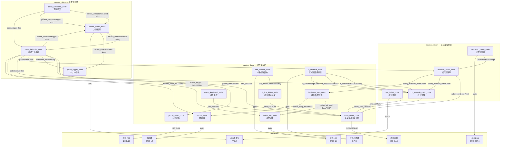

# 系统架构文档

## 整体架构

本项目采用 **ROS2 分布式节点架构**，分为三个功能包，节点间通过 ROS2 Topic 松耦合通信。

```
┌─────────────────────────────────────────────────────────────────┐
│                        raspbot_bringup                          │
│                     (launch 编排 & 启动)                        │
└──────────────────────────┬──────────────────────────────────────┘
                           │ 启动
          ┌────────────────┼────────────────┐
          ▼                ▼                ▼
┌─────────────────┐ ┌─────────────────┐ ┌─────────────────┐
│  raspbot_base   │ │ raspbot_vision  │ │ raspbot_vision  │
│  (硬件驱动层)    │ │ (感知与控制层)   │ │ (巡逻业务层)    │
└─────────────────┘ └─────────────────┘ └─────────────────┘
```

---

## 节点拓扑图



---

## 三层架构详述

### 第一层：硬件驱动层 (`raspbot_base`)

负责所有硬件设备的抽象和 ROS2 封装。

| 节点 | 硬件接口 | 发布 Topic | 订阅 Topic |
|------|---------|-----------|-----------|
| `base_driver_node` | I2C (0x16) | — | `cmd_vel`, `safety_cmd_vel` |
| `line_tracker_node` | GPIO 17/4/27/22 | `line_tracker` | — |
| `ir_obstacle_node` | GPIO 9/10/25 | `ir_obstacle`, `ir_obstacle/left`, `ir_obstacle/right` | — |
| `gimbal_servo_node` | I2C (0x16) | `gimbal_joint_states` | `gimbal_cmd` |
| `buzzer_node` | GPIO 12 | — | `buzzer_cmd`, `buzzer_beep_ms` |
| `status_led_node` | GPIO 5/6 | — | `status_led_cmd` |
| `hardware_alert_node` | — | `status_led_cmd`, `buzzer_beep_ms` | `safety_override_active` |
| `ir_line_follow_node` | — | `cmd_vel` | `line_tracker` |
| `teleop_keyboard_node` | — | `cmd_vel` | — |

### 第二层：感知与控制层 (`raspbot_vision` — 部分)

实现具体的感知能力和安全控制策略。

| 节点 | 功能 | 算法 |
|------|------|------|
| `line_follow_node` | 摄像头黑线循线 | ROI 阈值分割 + 轮廓质心 + 平滑投票 |
| `ultrasonic_range_node` | HC-SR04 测距 | 脉冲宽度测量 + 温度补偿声速 + 中值滤波 |
| `obstacle_avoid_node` | 超声波避障安全接管 | 距离阈值触发 → 后退 → 转向 → 确认清除 → 释放 |
| `ir_obstacle_avoid_node` | 红外避障安全接管 | 左右独立检测 → 智能转向方向选择 |

### 第三层：巡逻业务层 (`raspbot_vision` — 部分)

实现完整的自主巡逻业务逻辑。

| 节点 | 功能 |
|------|------|
| `person_detect_node` | 人体检测（连续/触发模式、多帧扫描、去抖、图像保存） |
| `patrol_behavior_node` | 巡逻状态机：云台三角度扫描 + 多轮确认 + 告警保持 |
| `patrol_scheduler_node` | 定时调度：按时间段 + 间隔自动触发巡逻 |
| `patrol_logger_node` | 事件持久化：SQLite 记录每次检测和巡逻结果 |

---

## 核心设计详述

### 1. 底盘安全架构

```
                    ┌──────────────┐
                    │  cmd_vel     │  ← 正常控制（循线/遥控/巡逻）
                    │  (优先级低)   │
                    └──────┬───────┘
                           │
                    ┌──────▼───────┐
                    │ base_driver  │
                    │    _node     │
                    └──────┬───────┘
                           │
              ┌────────────┼────────────┐
              │            │            │
     ┌────────▼───┐ ┌─────▼──────┐ ┌──▼──────────┐
     │ safety_    │ │ watchdog   │ │ destroy_    │
     │ cmd_vel    │ │ 0.5s 超时  │ │ node()      │
     │ (优先级高)  │ │ 自动停车   │ │ 析构停车    │
     └────────────┘ └────────────┘ └─────────────┘
```

**安全指令优先级规则**：
1. 节点销毁 → 立即停车（最高优先级）
2. `safety_cmd_vel` 活跃期间 → 屏蔽 `cmd_vel`（安全优先）
3. `cmd_vel` 超过 0.5s 未收到 → 看门狗停车（通信中断保护）

### 2. 避障安全接管流程

```
正常行驶
  │
  ├─ 超声波检测到障碍物 (< 0.18m)
  │    │
  │    ├─ 发布 safety_override_active = true
  │    ├─ 屏蔽 cmd_vel，接管控制
  │    │
  │    ├─ Phase 1: 后退 (0.35s)
  │    ├─ Phase 2: 转向 (0.55s，交替左右)
  │    ├─ Phase 3: 保持停止
  │    │
  │    ├─ 确认路径畅通 (连续3次读数 > 0.26m)
  │    └─ 释放控制，允许 cmd_vel 恢复
  │
  ├─ 红外检测到障碍物
  │    │
  │    ├─ 单侧障碍 → 反向转向
  │    ├─ 双侧障碍 → 后退 → 转向
  │    └─ 路径清除 → 释放
  │
  └─ 两种避障互斥：
       - IR 避障监听 ultrasonic 的 safety_override_active
       - ultrasonic 活跃时 IR 自动退让
```

### 3. 巡逻行为状态机（P3 多轮确认）

```
                    ┌──────────┐
                    │   IDLE   │ ← 等待触发
                    └────┬─────┘
                         │ patrol/trigger = true
                    ┌────▼──────┐
                    │ STOP_ROBOT│ ← 停车 + LED 蓝灯
                    └────┬──────┘
                         │ stop_settle_sec
                    ┌────▼──────┐
                    │WAIT_GIMBAL│ ← 转动云台到目标角度
                    └────┬──────┘
                         │ settle_time_sec
                    ┌────▼──────┐
                    │WAIT_RESULT│ ← 触发人体检测
                    └────┬──────┘
                  ┌──────┴───────┐
                  │              │
            ╔════▼════╗  超时 ╔══▼═══╗
            ║ 收到结果 ║──────→║重试? ║
            ╚════┬════╝       ╚══┬═══╝
                 │          ┌────┴────┐
                 │          │ 是:重发  │──→ WAIT_RESULT
                 │          │ 否:超时  │
                 │          └────┬────┘
                 │               │
                 └───────┬───────┘
                    ┌────▼──────┐
                    │ 下一个角度? │──→ 是 → WAIT_GIMBAL
                    └────┬──────┘
                         │ 否 (left→center→right 完成)
                    ┌────▼──────┐
                    │ FEEDBACK  │ ← 本轮结果 LED+蜂鸣
                    └────┬──────┘
                         │ feedback_duration_sec
                    ┌────▼──────────┐
                    │ 检查多轮历史   │ ← evaluate_round_history()
                    └────┬──────────┘
              ┌──────────┴──────────┐
              │                     │
    ┌────▼───────┐          ┌──────▼──────┐
    │ 确认 occupied │          │ 未确认      │
    │              │          │ occupied/  │
    │ OCCUPIED_HOLD│          │ empty/none  │
    │ 红灯+蜂鸣保持│          │ 返回 IDLE   │
    │ occupied_   │          └─────────────┘
    │ hold_sec    │
    └────┬───────┘
         │ 保持结束 → 关灯+alert=false
         ▼
       IDLE
```

**本轮决策逻辑**（单轮扫描内）：

| 条件 | 判决 |
|------|------|
| 所有角度无检测 | `empty` |
| ≥2 个角度检测到人 | `occupied` |
| max_confidence ≥ 0.60 | `occupied` |
| ≥2 人同时出现 | `occupied` |
| 仅 1 个角度检测到但置信度不高 | `uncertain` |
| 有传感器错误且无阳性检测 | `uncertain` |

**多轮确认逻辑**（跨轮次历史）：

| 条件 | 确认结果 | 动作 |
|------|---------|------|
| 最近 N 轮均为 `occupied`（N ≥ confirm_occupied_rounds） | `occupied` | 进入 OCCUPIED_HOLD，publish `patrol/alert=true` |
| 最近 M 轮均为 `empty`（M ≥ confirm_empty_rounds） | `empty` | 直接 IDLE，`patrol/alert=false` |
| 不足阈值或中间有中断 | `none` | 返回 IDLE，等待下一轮触发 |

> 默认参数：`confirm_occupied_rounds=2`, `confirm_empty_rounds=3`

### 4. 人体检测多帧扫描

```
触发信号
  │
  ├─ 连续模式 (continuous_mode=true)
  │     └─ 直接检测当前帧 → 去抖 → 发布
  │
  └─ 触发模式 (continuous_mode=false, 默认)
        │
        ├─ 按 trigger_scan_interval_sec 间隔抓取 N 帧
        ├─ 每帧独立检测
        ├─ 选择得分最高的帧
        │
        ├─ 接受条件（满足其一即可）：
        │     ├─ 阳性帧数 ≥ trigger_scan_min_positive_frames (默认1)
        │     └─ 最高置信度 ≥ trigger_scan_strong_confidence (默认0.80)
        │
        └─ 去抖 (Debounce)：
              ├─ 连续 detect_on_frames 帧阳性 → 状态切换为 detected
              ├─ 连续 detect_off_frames 帧阴性 + 超过 min_detect_hold_sec
              │    + 超过 clear_after_no_detection_sec → 状态切换为 clear
              └─ 中间状态保持上一状态（防止闪烁）
```

### 5. I2C 通信协议

底盘控制板通过 I2C 总线通信，设备地址 `0x16`：

| 寄存器 | 操作 | 数据格式 | 功能 |
|--------|------|---------|------|
| `0x01` | 写入 | `[左方向, 左速度, 右方向, 右速度]` | 电机控制（方向: 0=后退, 1=前进; 速度: 0-255） |
| `0x02` | 写入 | `[0x00]` | 立即停止 |
| `0x03` | 写入 | `[舵机ID, 角度]` | 舵机控制（角度: 0-180） |

---

## 数据流转全景

```
┌──────────────────────────────────────────────────────────────────────────────┐
│                          数据流转全景                                        │
│                                                                              │
│  摄像头 ──BGR──→ line_detector ──offset──→ decision ──action──→             │
│                                    │                    │                    │
│  红外传感器 ──GPIO──→ line_tracker_node ──加权误差──→ ir_follow             │
│                                                               │              │
│                                             ┌──── cmd_vel (Twist) ───────────┤
│  键盘 ──stdin──→ teleop_keyboard ───────────┤                                │
│                                             │    ┌──────────────────┐       │
│  超声波 ──GPIO──→ ultrasonic_range ──Range──→    │  base_driver_    │       │
│                              │               │   │  node            │──I2C──→ 底盘
│  红外避障 ──GPIO──→ ir_obstacle_node ──→ safety_ │  (看门狗+仲裁)   │       │
│                              │    cmd_vel ──┤    └──────────────────┘       │
│                              │               │                               │
│  巡逻调度 ──Timer──→ scheduler ──trigger──→ patrol_behavior_node             │
│                                               │    │                         │
│  人体检测:                                   │    ├─ patrol/confirmed_status │
│    camera → detector → debounce → result ────┘    ├─ patrol/alert (Bool)    │
│                                                    └─ patrol/final_result    │
│                                                                              │
│  日志:                                                                       │
│    person_detection/status ──→ patrol_logger ──→ SQLite                      │
│    patrol/final_result ──→ patrol_logger ──→ SQLite                          │
│                                                                              │
│  Web Dashboard:                                                              │
│    patrol/confirmed_status ──→ WebSocket ──→ 浏览器  ✓ 确认状态指示         │
│    patrol/alert ──→ WebSocket ──→ 浏览器  ⚠️ 告警横幅                        │
│    person_detection/debug/compressed ──→ MJPEG ──→                      │
└──────────────────────────────────────────────────────────────────────────────┘
```

---

## 关键设计决策

### 为什么用两个 safety topic？

`obstacle_avoid_node` 和 `ir_obstacle_avoid_node` 都往 `safety_cmd_vel` 发布，但通过 `safety_override_active` 消息互相通知状态。这种设计使得：

- 两个安全系统可以独立运行、独立升级
- 发生冲突时（两个同时激活），由各自节点内部仲裁退让
- 巡逻进行时（`patrol/active`），两个系统同时释放安全接管

### 为什么摄像头用双后端？

OpenCV 的 V4L2 后端在某些 USB 摄像头上会随机失败（`VIDIOC_DQBUF` 超时）。v4l2-ctl fallback 使用独立的进程读取帧，虽然更慢（~150ms/帧），但极端情况下能保证基本可用。

### 为什么去抖使用多数投票而不是简单平均？

偏移量平均在处理对称噪声时有效，但不能防止 LEFT/RIGHT 之间的决策抖动。多数投票在处理"边界情况"时更稳定 — 比如当黑线接近 dead_zone 边界，偏移量来回微跳时。

### 为什么引入多轮确认？

单轮巡逻可能在以下情况下误判：
- **误报**：一只猫走过、光线变化导致帧检测错误
- **漏报**：摄像头短暂卡顿、人体被短暂遮挡

多轮确认机制（P3）要求连续 N 次得到相同结果才确认，大幅提高稳定性。代价是响应变慢（需要多轮才能确认），但对于巡检业务场景（几分钟一轮）是可接受的。

### 为什么要发布独立的 `patrol/alert` topic？

`patrol/alert`（Bool）将"确认有人"这一最高优先级的告警信号从复杂的 JSON 状态中剥离出来，方便其他系统模块（如短信网关、大屏显示、MQTT 转发）仅需订阅一个简单 Bool 即可触发联动，无需解析 JSON。

## 2026-08-12 安全与可移植性加固

底盘入口现在先检查 `/cmd_vel` 的线速度和角速度是否为有限数；收到 `NaN` 或无穷值时立即停车并拒绝该命令。该检查是软件输入兜底，不能取代物理急停或底层避障。

Agent 路线链路变为：人工确认 → 路线白名单 → 新鲜且安全的超声波值 → 路线互斥检查 → `/route_patrol/start` → 最大时长监督。网关与 `route_patrol_node` 分别承担“启动准入”和“执行中暂停/恢复”；前者默认 0.30 m/2 s，后者仍保留自身 0.25/0.35 m 阈值。路线名目前不选择不同 YAML 路线。

Dashboard 默认仅监听 `127.0.0.1`，浏览器控制默认关闭。只有显式启用远程监听、控制开关及 token 后才允许控制消息；监控数据的网络可见性仍须由部署网络控制。远程通知改为后台发送，并支持钉钉 secret 签名；默认配置依然关闭。

运行时模型、图片、数据库与 Agent 日志的主要 Python 路径可由 `RASPBOT_WS` 配置。离线和实机证据范围分别见 [OFFLINE_VERIFICATION.md](OFFLINE_VERIFICATION.md) 与 [PI_VALIDATION_CHECKLIST.md](PI_VALIDATION_CHECKLIST.md)。
